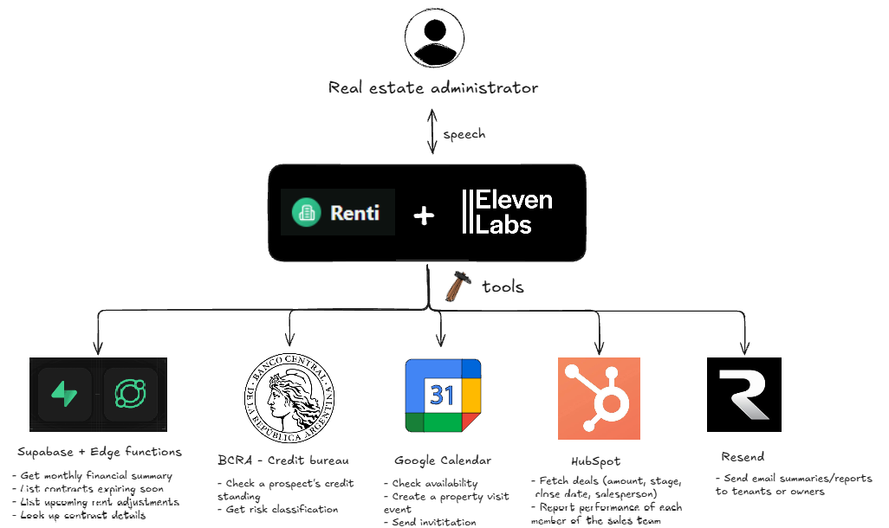

# 2. Architecture

## System diagram

The real estate administrator talks to Renti IA (the ElevenLabs agent) by voice. The agent calls out to five tool groups: the `voice-agent-api` Supabase Edge Function (financial summaries, expiring leases, upcoming rent adjustments, property lookups — plus `enviar_reporte`, which hands off to Resend for delivery), the BCRA public credit-bureau API, Google Calendar (native OAuth integration, availability check before booking), HubSpot (both the native connector and the custom webhook tool that reads the `vendedor` deal property), and Resend for transactional email. The `voice-agent-api` function itself reads and writes the same Supabase Postgres tables (`historico`, `propiedades`) that back the `property-flow` app.

## Components

### ElevenLabs Agent ("Renti IA")
The orchestration layer. Owns the system prompt, the LLM (kept at its default, Qwen3.5-397B-A17B — see [08-elevenlabs-agent-config.md](08-elevenlabs-agent-config.md) for why this was deliberately left untouched), and the tool definitions. Tools are a mix of **custom webhook tools** (manually configured HTTP calls) and **native integrations** (OAuth-based connectors that ElevenLabs manages).

### Supabase Edge Function — `voice-agent-api`
A single, lightweight, request/response JSON endpoint that backs 6 of the agent's custom tools. It's a **separate function from the existing web chat backend** (`asistente-chat`), which is built for streaming + browser JWT auth and wouldn't fit a webhook-tool call pattern. `voice-agent-api` reuses the same underlying business logic (querying the `historico` and `propiedades` tables) but exposes it as plain `POST` + `{accion, params}` JSON, authenticated with a static shared secret header instead of a user session.

See [03-supabase-backend.md](03-supabase-backend.md) for the full contract.

### BCRA (Banco Central de la República Argentina)
A public, unauthenticated REST API that exposes each person's/company's registered debt situation by CUIT/CUIL. No setup required on our side — it's called directly as a `GET` webhook tool. See [07-bcra-integration.md](07-bcra-integration.md).

### Google Calendar
A native ElevenLabs integration (OAuth), not a custom webhook — connected directly through the ElevenLabs integrations marketplace with the demo agency's Google account. See [05-google-calendar.md](05-google-calendar.md).

### HubSpot
Two parallel integration paths exist on the agent:
- A **native HubSpot connector** (contacts/companies CRUD tools), connected via OAuth to a dedicated new HubSpot portal for this demo.
- A **custom webhook tool** (`consultar_performance_vendedores`) that queries deals directly via the HubSpot REST API with a service-key token, because the sales-performance use case needed a custom deal property (`vendedor`) that isn't exposed by the native connector's tools.

See [06-hubspot-crm.md](06-hubspot-crm.md).

### Resend
Transactional email provider used by the `enviar_reporte` action inside `voice-agent-api`. Originally used the Resend sandbox domain (`onboarding@resend.dev`), which turned out to only deliver to the account's own registered address — fixed by verifying a real domain (`renti.com.ar`). See [04-email-integration.md](04-email-integration.md).

## Design decisions worth calling out

- **One shared backend endpoint, not one function per tool.** `voice-agent-api` takes an `{accion, params}` envelope rather than exposing 5 separate Edge Functions. Simpler to secure (one shared secret), simpler to extend (add a case to the switch), and keeps the webhook-tool configuration in ElevenLabs uniform.
- **Static shared-secret auth for the voice backend**, not the app's normal user JWT — there's no browser session for a voice agent to present, so a fixed `x-agent-secret` header (stored as an ElevenLabs workspace secret, never inlined in a tool config) was used instead.
- **Custom webhook tool for HubSpot deals, alongside the native connector** — the native connector's CRUD tools don't support querying by an arbitrary custom property, so the sales-performance use case needed a direct API call instead.
